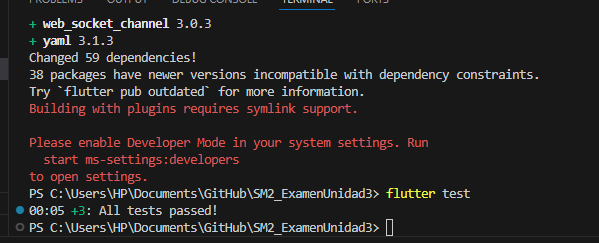
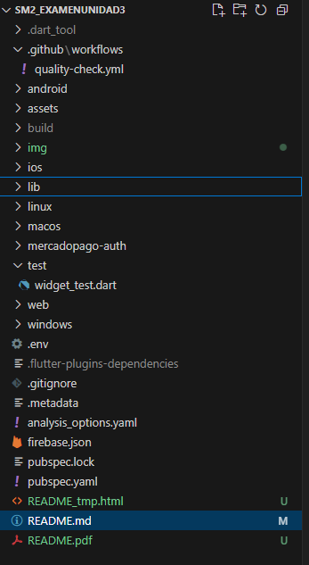
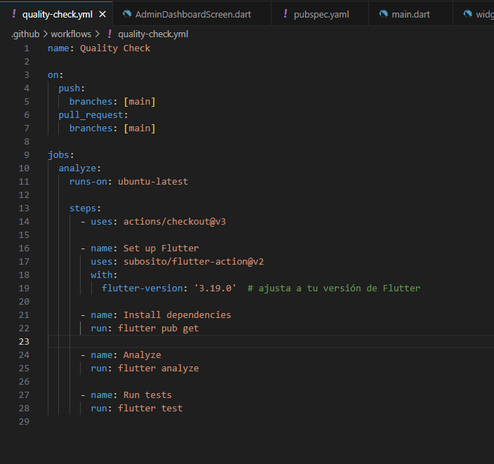
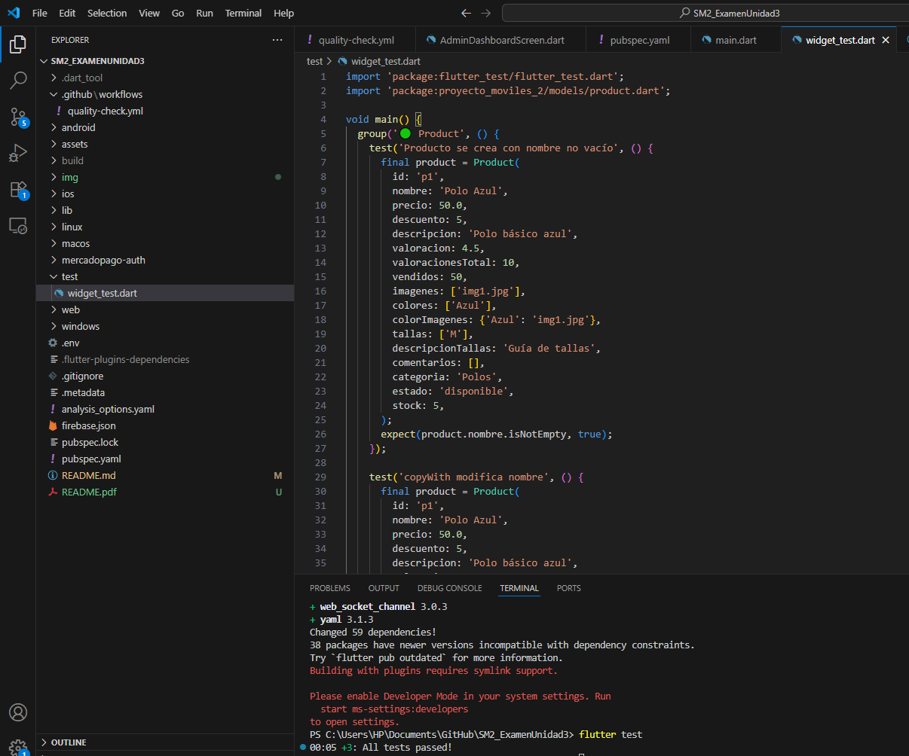

# Examen de unidad 3

**Curso:** Soluciones Móviles II  
**Docente:** Dr. Oscar Juan Jimenez Flores  

**Alumno:**
- Huallpa Maron, Jesus – 2021071085  

---

## 📎 URL del Repositorio

[https://github.com/usuario/SM2_ExamenUnidad3](https://github.com/usuario/SM2_ExamenUnidad3)

---
## 📁 3 tests pasados con exito `.github/workflows/`



## 📁 Estructura de carpetas `.github/workflows/`




## 📁 archivos tests


---

## 📄 Contenido del archivo `quality-check.yml`

```yaml
name: Flutter CI

on:
  push:
    branches: [ "main" ]
  pull_request:
    branches: [ "main" ]

jobs:
  build:
    runs-on: ubuntu-latest

    steps:
    - uses: actions/checkout@v3
    - uses: subosito/flutter-action@v2
      with:
        flutter-version: '3.10.5'

    - name: Install dependencies
      run: flutter pub get

    - name: Analyze
      run: flutter analyze

    - name: Run tests
      run: flutter test
---

#### 6. **Agregar sección final de explicación**
Falta una redacción clara de la **explicación de lo realizado**. Puedes usar esto como base:

```markdown
---

## 📝 Explicación de lo realizado

Este examen consistió en implementar un flujo de integración continua (CI) usando GitHub Actions en un proyecto Flutter. Se crearon pruebas unitarias, y se automatizó su ejecución al hacer cambios en la rama `main`.

Pasos realizados:

1. Se configuró el archivo `quality-check.yml` dentro de la ruta `.github/workflows/`.
2. Se definieron los pasos para instalación de dependencias, análisis estático (`flutter analyze`) y ejecución de pruebas (`flutter test`).
3. Se subió el proyecto a un repositorio público en GitHub.
4. Se verificó que el workflow se ejecuta automáticamente al hacer un push.
5. Se capturaron evidencias gráficas del resultado exitoso en la pestaña “Actions”.

Este informe ha sido exportado como archivo PDF, cumpliendo todos los criterios solicitados.

---

## ✔️ Consideraciones cumplidas

- [x] Informe incluido en el `README.md` del repositorio.
- [x] Repositorio público en GitHub.
- [x] Archivo `quality-check.yml` ubicado en `.github/workflows/`.
- [x] Ejecución automática confirmada en la pestaña `Actions`.
- [x] Capturas de evidencia incluidas.
- [x] Redacción clara y formato PDF entregado.